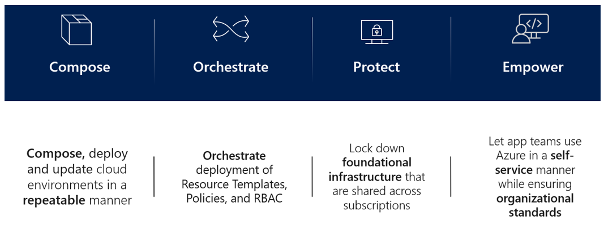
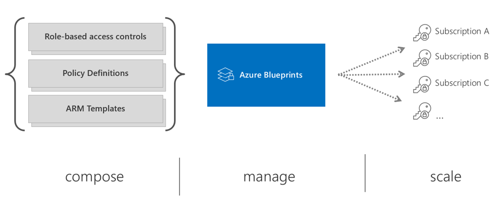
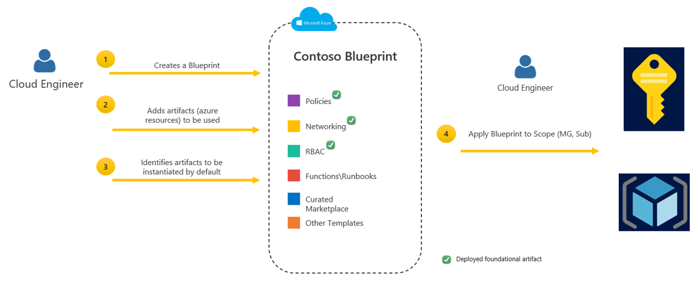

## Azure Blueprints

How can you bring everything that has already been discussed in a structured way, so that you can configure your environment in a consistent and automated way, at scale in the shortest possible time?

For a developer, there is a lot to do when setting up an Azure subscription for the first time. As you might say, Azure is an empty canvas and if you are not an artist, there is a lot to draw. And trying to fill that screen with a base image is what Blueprint really is about. He tries to create a fundamental foundation for the appearance of his environment.

There is no reason for your DevOps team to become a ninja on the Azure network, they just need to focus on their code, business logic, etc. and that's it.

What happens today is that you provide them with a giant document with all the required specifications and organize several meetings with them to make sure that they understand and follow those specifications, or just do everything for them, which increases the time of implementation, as there would be an alignment of other devops waiting for your environment to be provisioned.

So, here are some of the main challenges for customers when designing and configuring the governance of their subscriptions:
* **Challenging to configure the basic infrastructure**: It becomes complex to create and redistribute the infrastructure.
* **Inability to create governed signatures**: Absence of a centralized way of defining and ensuring that what is created or made available in a signature will be applied. The client uses a ton of scripts to try to do this.
* **Protection of critical resources**: Subscription owners can modify resources and remove policies in violation of best practices defined by cloud architects.
Therefore, to address these key challenges faced by customers, Azure Blueprints was created where you have an automated and easy-to-deploy solution to help set up Azure Subscriptions in line with a governance strategy.

Azure Blueprints allows you to implement Governance as Code.

### How Azure BLueprints works

