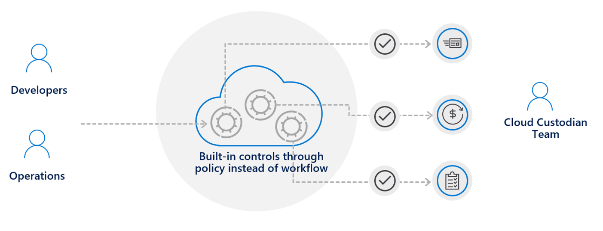

## Why is governance needed?

Companies are adopting the cloud to be more agile and save money. There is pressure to transform and innovate digitally, so that you no longer have time to focus on your own infrastructure. You want to focus on making your customers happy by providing high quality services with the support of your engineering teams. So there is a natural shift to DevOps in a cloud environment, where engineers will more quickly provide the resources needed to support a solution.

However, this agility and easy access to resources comes at a price and many companies are struggling to control this Cloud Sprawl. We have seen this before, in early 2000, with the introduction of virtualization and the proliferation of virtualization.

How did the industry react to this expansion? We jumped in front of the developers and the operations teams and stopped them before things got out of hand. We then introduced a formal process for these teams to follow where they should fill out a form so that the infra team could set up everything and in 2 weeks they would have access to their environment.

<em>Traditional approach, sacrificing speed for control</em>

 
However, this approach in the cloud age slows things down and you sacrifice speed to be in control.

In a cloud-native governance model, you get both speed and control at the same time. So instead of jumping in front of the DevOps team to make sure they’re doing the right things, the cloud platform itself will enforce that control on your behalf. This allows them to have full access to the platform through a self-service model that is essential to maintain agility and speed.

You can guarantee that your teams will deploy only approved resources and anything outside these rules will be effectively denied. That way, you keep your costs predictable and more in line with your budget.

<em>Native cloud governance model, with speed and control together</em>

 

Aligned with governance it's important to have a well defined structure around responsabilities across different teams, specially if you are migrating from an tradittional approach to cloud approach. That said, you shoud take a look into those references to help yuu mature team structures and align responsabilities within them:

* [Mature team structures](https://docs.microsoft.com/en-us/azure/cloud-adoption-framework/organize/organization-structures)
* [Align responsibilities across teams](https://docs.microsoft.com/en-us/azure/cloud-adoption-framework/organize/raci-alignment)

Also, if Cloud is something new for you I have some suggestions to help you start to build your technical skills:

* [Building technical skills](https://docs.microsoft.com/en-us/azure/cloud-adoption-framework/organize/suggested-skills)
* [Azure Fundamentals part 1: Describe core Azure concepts](https://docs.microsoft.com/en-us/learn/paths/az-900-describe-cloud-concepts/)
* [Azure Fundamentals part 2: Describe core Azure services](https://docs.microsoft.com/en-us/learn/paths/az-900-describe-core-azure-services/)
* [Azure Fundamentals part 3: Describe core solutions and management tools on Azure](https://docs.microsoft.com/en-us/learn/paths/az-900-describe-core-solutions-management-tools-azure/)
* [Azure Fundamentals part 4: Describe general security and network security features](https://docs.microsoft.com/en-us/learn/paths/az-900-describe-general-security-network-security-features/)
* [Azure Fundamentals part 5: Describe identity, governance, privacy, and compliance features](https://docs.microsoft.com/en-us/learn/paths/az-900-describe-identity-governance-privacy-compliance-features/)
* [Azure Fundamentals part 6: Describe Azure cost management and service level agreements](https://docs.microsoft.com/en-us/learn/paths/az-900-describe-azure-cost-management-service-level-agreements/)
* [Prerequisites for Azure administrators](https://docs.microsoft.com/en-us/learn/paths/azure-administrator-prerequisites/)
* [Build great solutions with the Microsoft Azure Well-Architected Framework](https://docs.microsoft.com/en-us/learn/paths/azure-well-architected-framework/)

---

:arrow_backward: Previous| Next → | 
:----- |-----:
| [Overview of Azure native features for cloud governance](/guide/overview-native-features.md)

