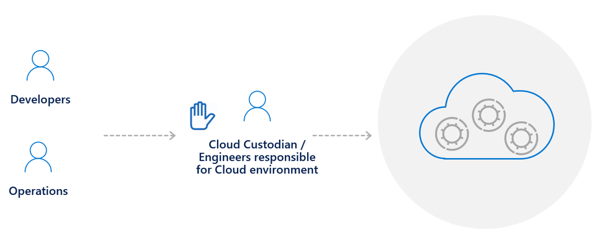

## Why is governance needed?

Companies are adopting the cloud to be more agile and save money. There is pressure to transform and innovate digitally, so that you no longer have time to focus on your own infrastructure. You want to focus on making your customers happy by providing high quality services with the support of your engineering teams. So there is a natural shift to DevOps in a cloud environment, where engineers will more quickly provide the resources needed to support a solution.

However, this agility and easy access to resources comes at a price and many companies are struggling to control this Cloud Sprawl. We have seen this before, in early 2000, with the introduction of virtualization and the proliferation of virtualization.

How did the industry react to this expansion? We jumped in front of the developers and the operations teams and stopped them before things got out of hand. We then introduced a formal process for these teams to follow where they should fill out a form so that the infra team could set up everything and in 2 weeks they would have access to their environment.

However, this approach in the cloud age slows things down and you sacrifice speed to be in control.
In a cloud-native governance model, you get both speed and control at the same time. So instead of jumping in front of the DevOps team to make sure they’re doing the right things, the cloud platform itself will enforce that control on your behalf. This allows them to have full access to the platform through a self-service model that is essential to maintain agility and speed.

You can guarantee that your teams will deploy only approved resources and anything outside these rules will be effectively denied. That way, you keep your costs predictable and more in line with your budget.

> Traditional approach, sacrificing speed for control

However, this approach in the cloud age slows things down and you sacrifice speed to be in control.
In a cloud-native governance model, you get both speed and control at the same time. So instead of jumping in front of the DevOps team to make sure they’re doing the right things, the cloud platform itself will enforce that control on your behalf. This allows them to have full access to the platform through a self-service model that is essential to maintain agility and speed.

You can guarantee that your teams will deploy only approved resources and anything outside these rules will be effectively denied. That way, you keep your costs predictable and more in line with your budget.

Native cloud governance model, with speed and control together

