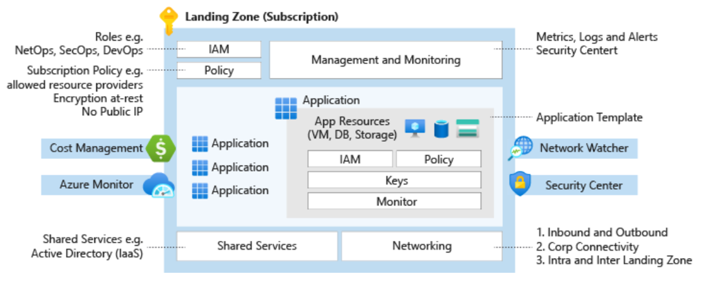

## Azure Subscription

As stated earlier, when creating an Azure subscription an AAD tenant is automatically created for you. With this, after creating and/or synchronizing users in Azure Active Directory, you can now allow your ADF users to subscribe to your subscription and its existing resources.

According with the size of your cloud environment, you can also create additional subscriptions or [associate other existing subscriptions](https://docs.microsoft.com/en-us/azure/active-directory/fundamentals/active-directory-how-subscriptions-associated-directory) with your Azure Active Directory tenant. Having at least two signatures, one for the productive environment and the other for non-productive ones, is a good practice for segregation of the environment and for [scalability](https://docs.microsoft.com/en-us/azure/cloud-adoption-framework/ready/azure-best-practices/scale-subscriptions).

An important point to be taken into account about permissioning is that there are two types of functions/attributions that are distinct but totally related to each other:

1. [Azure Roles](https://docs.microsoft.com/en-us/azure/role-based-access-control/rbac-and-directory-admin-roles#azure-roles): Azure Roles use [Role Based Access Control (RBAC)](https://docs.microsoft.com/en-us/azure/role-based-access-control/overview) and are granted in the context of Azure resources within a subscription. There are three basic roles of Owner, Collaborator and Reader. In addition to them there are more than 70 other roles that are more related to services specifically, [here you can see the list with all](https://docs.microsoft.com/en-us/azure/role-based-access-control/built-in-roles). In addition to the native functions, you may want to create your own [custom roles](https://docs.microsoft.com/en-us/azure/role-based-access-control/custom-roles) and maximize the type of control you want to apply.
2. [Azure Active Directory roles](https://docs.microsoft.com/en-us/azure/role-based-access-control/rbac-and-directory-admin-roles#azure-ad-roles): Azure Active Directory roles are used exclusively for the management of Azure Active Directory resources.

This image can help you understand a little about how the functions of Azure and Azure Active Directory are related:

An Azure subscription has a trust relationship with the AAD to authenticate and authorize users, services and devices.

It is important to know that the same AAD tenant can have multiple signatures trusting him, but each signature can only confirm on a single AAD tenant. It means that you can have the same user base on the AAD tenant for different subscriptions.

A signature is a logical container for your resources and each resource is associated with only one signature. They are directly related to billing and payment.

The data in the subscriptions remains for a while after being canceled, and the subscriptions themselves are usually visible, even after being canceled in the Portal and in the APIs. There is information about the cancellation process in the [documentation available here](https://docs.microsoft.com/en-us/azure/cost-management-billing/manage/cancel-azure-subscription).

A subscription serves different purposes because it is a legal contract, a payment contract, a scale limit and an administrative limit. All details are [described in this link](https://docs.microsoft.com/en-us/azure/cloud-adoption-framework/ready/considerations/fundamental-concepts#azure-subscription-purposes).

It is important to define an architecture on the use of signatures so that there is a better organization and management of resources, especially on the segregation of permission and control of [existing limits on signatures](https://docs.microsoft.com/en-us/azure/azure-resource-manager/management/azure-subscription-service-limits). To help with this, there is a documented [decision guide](https://docs.microsoft.com/en-us/azure/cloud-adoption-framework/decision-guides/subscriptions/) that is super interesting to understand the best way to model your organization and define signature design strategies.

### Briefly description about Azure Landing Zones

As described in [this link](https://docs.microsoft.com/en-us/azure/cloud-adoption-framework/ready/azure-best-practices/initial-subscriptions), the recommendation is that there are at least two signatures, one for the productive environment and the other for the non-productive environment. Depending on the size of your environment or the strategy of your company, it may be necessary to create more signatures and in addition to combine the design of signatures with the definition of the [landing zone](https://docs.microsoft.com/en-us/azure/cloud-adoption-framework/ready/landing-zone/) to be created.

The Microsoft [Cloud Adopt Framework](http://aka.ms/caf) describes in details about several topics over the enterprise-scale landing zone architecture, which offers a modular design and not only makes it simple to deploy existing and new applications but also allows organizations to start with a lighter deployment implementation and scale depending on their business needs.

Basically, the landing zone will deal with a set of considerations and recommendations based on some design areas:

- [Enterprise agreement (EA) enrolment and Azure Active Directory tenants](https://docs.microsoft.com/azure/cloud-adoption-framework/ready/enterprise-scale/enterprise-enrollment-and-azure-ad-tenants/)
- [Identity and access management](https://docs.microsoft.com/azure/cloud-adoption-framework/ready/enterprise-scale/identity-and-access-management/)
- [Management group and subscription organization](https://docs.microsoft.com/azure/cloud-adoption-framework/ready/enterprise-scale/management-group-and-subscription-organization/)
- [Network topology and connectivity](https://docs.microsoft.com/azure/cloud-adoption-framework/ready/enterprise-scale/network-topology-and-connectivity/)
- [Management and monitoring](https://docs.microsoft.com/azure/cloud-adoption-framework/ready/enterprise-scale/management-and-monitoring/)
- [Business continuity and disaster recovery](https://docs.microsoft.com/azure/cloud-adoption-framework/ready/enterprise-scale/business-continuity-and-disaster-recovery/)
- [Security, governance, and compliance](https://docs.microsoft.com/azure/cloud-adoption-framework/ready/enterprise-scale/security-governance-and-compliance)
- [Platform automation and DevOps](https://docs.microsoft.com/en-us/azure/cloud-adoption-framework/ready/enterprise-scale/platform-automation-and-devops)

In the landing zone, the choice of network topology to be used is important for the process of governance defitinition. As example, the Hub and Spoke topology may be inserted in the context of subscriptions as follows:

- A first subscription to **shared services** (Hub Virtual Network)
- A second subscription to the **production** environment (Spoke 1 Virtual Network)
- A third subscription to the **non-production** environment (Spoke2 Virtual Network)
- Some references about Hub and Spoke topology:
  - [https://docs.microsoft.com/en-us/azure/architecture/reference-architectures/hybrid-networking/hub-spoke](https://docs.microsoft.com/en-us/azure/architecture/reference-architectures/hybrid-networking/hub-spoke)
  - [https://docs.microsoft.com/en-us/azure/cloud-adoption-framework/decision-guides/software-defined-network/hub-spoke](https://docs.microsoft.com/en-us/azure/cloud-adoption-framework/decision-guides/software-defined-network/hub-spoke)

Currently, enterprise-scale offers [three different reference implementations](https://docs.microsoft.com/en-us/azure/cloud-adoption-framework/ready/enterprise-scale/implementation), which all can be scaled without refactoring when requirements change over time:

- [Enterprise-scale foundation](https://github.com/Azure/Enterprise-Scale/blob/main/docs/reference/wingtip/README.md)
- [Enterprise-scale hub and spoke](https://github.com/Azure/Enterprise-Scale/blob/main/docs/reference/adventureworks/README.md)
- [Enterprise-scale Virtual WAN](https://github.com/Azure/Enterprise-Scale/blob/main/docs/reference/contoso/Readme.md)

### Pro tip

✔️ [Enterprise-Scale - Reference Implementation](https://github.com/Azure/Enterprise-Scale)

---

| Previous                      | Next                                  |
| :---------------------------- | :------------------------------------ |
| [Naming Standards](naming.md) | [Resource Groups](resource-groups.md) |
